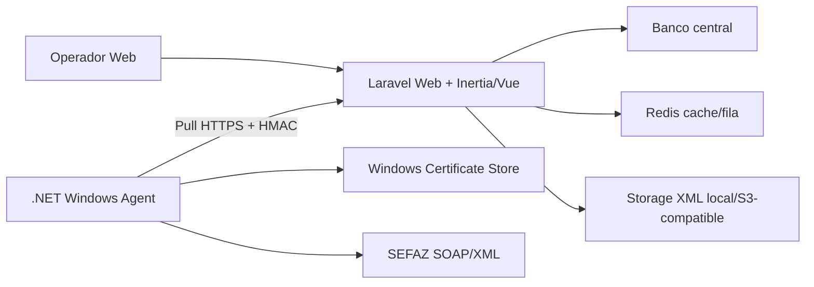

# MWS Manifestador NF-e - Arquitetura

## Visao Geral

O MWS Manifestador NF-e e composto por uma aplicacao Web/API central em Laravel e um agente local Windows em .NET. A aplicacao central gerencia usuarios, empresas, agentes, comandos, documentos fiscais, manifestacoes, storage, historico e auditoria. O agente local executa operacoes que dependem do ambiente do cliente, principalmente acesso a certificado A3 instalado no Windows e chamadas SOAP para a SEFAZ.

## Componentes

- `Web App`: interface operacional em portugues brasileiro para dashboard, empresas, agentes, documentos fiscais, manifestacao, historico e configuracoes.
- `Agent API`: endpoints REST versionados em `/api/agent/v1/*`, autenticados por HMAC depois da ativacao.
- `Domain/Application Services`: regras fiscais, maquina de estados de manifestacao, criacao de comandos, lock, idempotencia e registro de resultados.
- `Agent Worker`: servico Windows .NET que ativa, envia heartbeat, busca comandos, executa comandos e reporta resultados.
- `Sefaz Client`: camada .NET que monta XML, assina XMLDSig, valida XSD, cria envelope SOAP, resolve endpoints e interpreta retornos.
- `Storage`: referencias para XMLs de envio/retorno e documentos fiscais, com abstracao para disco local ou S3-compatible.

## Decisoes Arquiteturais

- Web/API em Laravel.
- Front-end com Inertia.js + Vue + TypeScript.
- Agente local em .NET Worker Service para Windows.
- Comunicacao agente-servidor por Agent Pull Model.
- Integracao SEFAZ direta via SOAP/XML, sem ACBr.
- Estados fiscais representados por enums e guard de transicao, nao strings soltas.
- Certificado A3 tratado localmente pelo agente; PIN nao trafega e nao e armazenado.

## Trade-offs

- Agent Pull Model reduz atrito de rede no cliente, mas introduz latencia entre comando criado e comando executado.
- Centralizar comandos na Web/API melhora auditoria, mas exige controle de lock, retry e idempotencia.
- Implementar SOAP/XML diretamente aumenta controle e auditabilidade, mas exige manutencao de schemas, assinatura XML e endpoints oficiais.
- A3 local preserva o modelo operacional do cliente, mas depende de drivers, token conectado e interacao do provedor para PIN.

## Motivo do Agent Pull Model

O agente sempre inicia a conexao HTTPS com a API central. Isso evita abertura de portas no cliente, NAT traversal, VPN obrigatoria e exposicao direta da maquina local. O modelo implementado hoje inclui:

- polling de comandos pendentes;
- lock com expiracao;
- start/complete/fail;
- retry ate `max_attempts`;
- idempotencia para comando ja concluido.

## Motivo do .NET no Agente

.NET e adequado ao agente porque integra bem com Windows Service, `HttpClientFactory`, `X509Certificate2`, Windows Certificate Store, DPAPI e drivers/provedores criptograficos instalados no Windows. Isso e essencial para certificado A3.

## Motivo do Laravel na Web

Laravel atende bem a aplicacao central por ter ecossistema maduro para API REST, validacao, policies, jobs, events/listeners, migrations, filas, cache, storage, testes e integracao com Inertia.

## Suporte A1/A3

- A3: implementado no agente via Windows Certificate Store. O agente lista certificados, valida validade/chave privada e busca por thumbprint. O PIN e solicitado pelo provedor/driver do token quando necessario.
- A1: previsto. A regra ja definida e nao armazenar senha em texto puro. Se houver armazenamento local no agente, deve usar DPAPI ou mecanismo equivalente.

## TODO

- Completar tela/fluxo administrativo de vinculo certificado-empresa.
- Completar rotacao de segredo com endpoint/acao operacional explicita.
- Completar persistencia final dos XMLs baixados no storage central.
- Completar cobertura PHPStan ate passar no nivel configurado.
