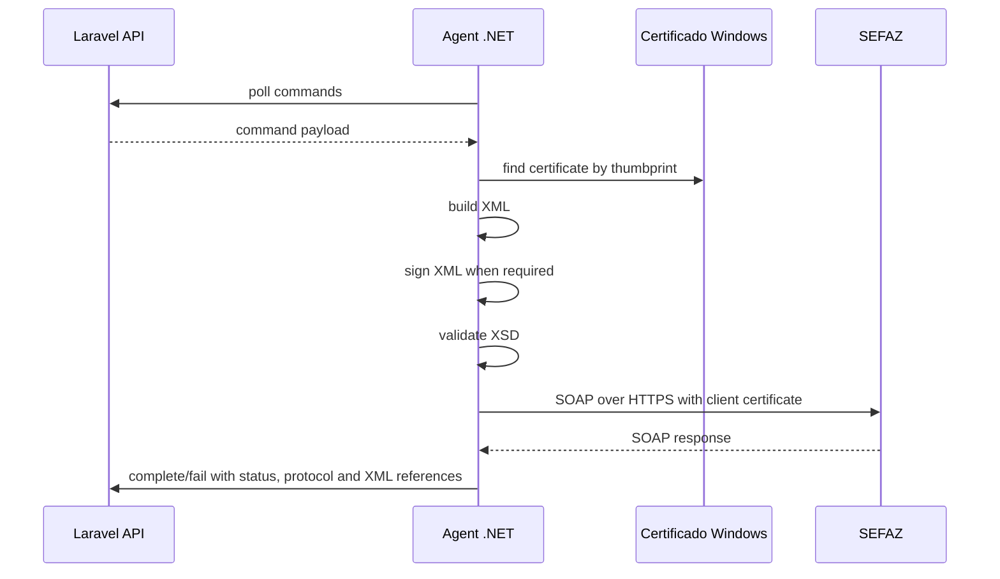

# Integracao SEFAZ

## Servicos Usados

Camada implementada no agente .NET:

- `NFeDistribuicaoDFe`: distribuicao de documentos fiscais de interesse.
- `NFeRecepcaoEvento`: envio dos eventos de Manifestacao do Destinatario.

## Fluxo Geral



## SOAP

O agente monta envelope SOAP usando endpoint resolvido por servico, UF e ambiente. A chamada e feita por `HttpClient` com certificado cliente quando exigido.

TODO:

- Revisar cabecalhos SOAP por UF/autorizador conforme schemas oficiais atualizados.
- Completar matriz oficial de endpoints para todas as UFs suportadas.

## XML Signature

Eventos de manifestacao sao assinados com XMLDSig no agente antes do envio. O signer recebe o XML, o certificado `X509Certificate2` e o atributo de referencia `Id`.

Regras:

- nao usar ACBr;
- nao logar XML completo por padrao;
- preservar XML de envio e retorno por referencia de storage;
- falha de assinatura deve retornar erro tecnico, nao sucesso fiscal.

## Schemas

O agente possui validador XSD (`NfeXmlSchemaValidator`) e usa diretorio configurado para schemas oficiais.

TODO:

- Versionar pacote de XSD oficial utilizado em producao.
- Criar rotina de atualizacao controlada dos schemas.

## Distribuicao DFe

Comando:

```json
{
  "type": "sync_fiscal_documents",
  "payload": {
    "uf": "SP",
    "environment": "homologation",
    "cnpj": "00000000000000",
    "last_nsu": "000000000000000",
    "certificate_thumbprint": "ABCDEF123456",
    "correlation_id": "corr-dist-001"
  }
}
```

O retorno e parseado para `last_nsu`, `max_nsu` e documentos distribuidos. A camada inclui descompactacao GZip/Base64 para `docZip`.

### Protecao contra consumo indevido

A Distribuicao DFe possui controle operacional por empresa, ambiente, UF e servico em `company_fiscal_states`.
Esse controle existe para impedir repeticao imediata de consultas quando a SEFAZ informa ausencia de documentos ou bloqueia por consumo indevido.

Codigos tratados:

| cStat | Resultado | Acao operacional |
| --- | --- | --- |
| `137` | Nenhum documento localizado | grava `last_nsu`/`max_nsu`, registra sucesso tecnico e aplica cooldown seguro. |
| `138` | Documento localizado | grava documentos e avanca NSU; se `ultNSU < maxNSU`, pode continuar conforme config; se `ultNSU == maxNSU`, aplica cooldown seguro. |
| `656` | Consumo indevido | registra falha operacional, bloqueia novas consultas ate `distribution_blocked_until` e nao avanca NSU. |

Configuracao:

```php
// config/sefaz.php
'distribution' => [
    'no_documents_cooldown_minutes' => 60,
    'consumption_denied_cooldown_minutes' => 60,
    'technical_error_backoff_minutes' => 5,
    'allow_immediate_continue_when_nsu_pending' => true,
],
```

Erros tecnicos locais, SOAP, certificado, XSD ou parse nao avancam `last_nsu`. Eles podem aplicar backoff curto por `technical_error_backoff_minutes`, mas nao sao tratados como rejeicao fiscal da SEFAZ.

A UI de Documentos Fiscais desabilita `Consultar SEFAZ` quando ha cooldown ou bloqueio operacional e mostra o horario de liberacao. A API nao cria novo `agent_command` enquanto a janela estiver ativa.

## Recepcao de Evento

Comandos:

- `manifest_acknowledgement`
- `manifest_confirmation`
- `manifest_unknown`
- `manifest_not_performed`

Exemplo:

```json
{
  "type": "manifest_not_performed",
  "payload": {
    "uf": "SP",
    "environment": "homologation",
    "cnpj": "00000000000000",
    "access_key": "00000000000000000000000000000000000000000000",
    "justification": "Operacao nao realizada por motivo operacional documentado.",
    "certificate_thumbprint": "ABCDEF123456",
    "correlation_id": "corr-event-001"
  }
}
```

## Eventos

| Evento | Codigo | Conclusivo | Observacao |
| --- | ---: | --- | --- |
| Ciencia da Operacao | 210210 | Nao | Aceite move documento para `pending_final_manifestation`. |
| Confirmacao da Operacao | 210200 | Sim | Exige confirmacao explicita ou regra administrativa. |
| Desconhecimento da Operacao | 210220 | Sim | Exige confirmacao explicita ou regra administrativa. |
| Operacao Nao Realizada | 210240 | Sim | Exige justificativa. |

## Ambientes

Ambientes modelados no agente:

- `production`
- `homologation`

O endpoint resolver resolve `NFeDistribuicaoDFe` via Ambiente Nacional e `NFeRecepcaoEvento` por UF, com fallback para Ambiente Nacional quando configurado.

## Tratamento de Erros

- Erro tecnico no agente retorna `fail` com `error_code` e `error_message`.
- Rejeicao SEFAZ reportada em `complete` nao e tratada como sucesso fiscal pela API; a maquina de estados marca `rejected`.
- Status aceitos atualmente como evento registrado: `135`, `136`, `155`.
- Timeout, erro de certificado, erro de assinatura ou erro de schema nao devem alterar manifestacao como sucesso.
- Falha tecnica `SEFAZ_XML_SCHEMA_INVALID` nao avanca NSU e nao aplica janela de `137`.
- Falha operacional `SEFAZ_DISTRIBUTION_CONSUMPTION_DENIED` bloqueia novas consultas e nao gera retry imediato.

## TODO

- Persistir XML completo baixado no storage central apos retorno do agente.
- Completar tratamento por `cStat` especifico, incluindo duplicidade de evento e eventos ja vinculados.
- Validar lote de eventos conforme limite oficial vigente.
